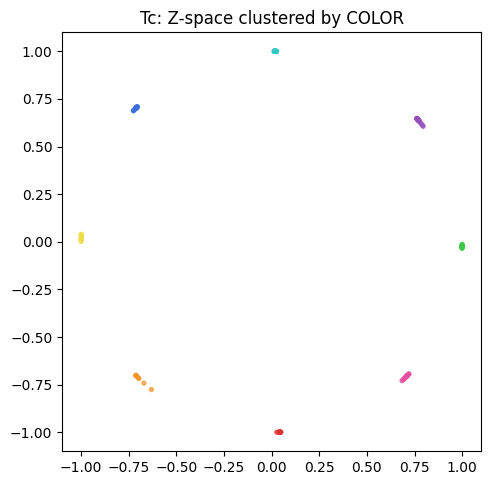
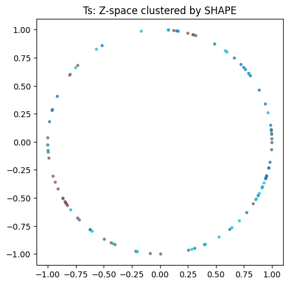
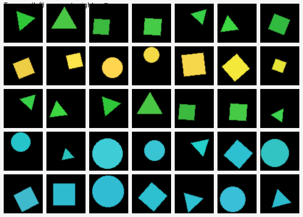
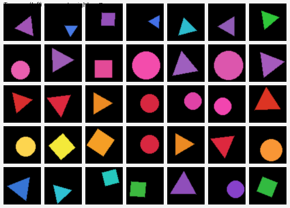

# Learning Shape and Color with Contrastive Learning Exercise

An independent implementation of a contrastive representation-learning exercise exploring how data augmentations influence the visual features learned by a neural network.

## Overview

This project investigates whether a contrastive-learning model can be encouraged to organize image representations according to different visual attributes.

Using a procedurally generated dataset of colored geometric shapes, I trained two convolutional encoders:

* A **color-sensitive encoder** trained using random crops that preserve color information.
* A **shape-sensitive encoder** trained using random crops and color augmentation, encouraging the model to prioritize shape over color.

Each encoder maps an image to a two-dimensional, unit-normalized embedding. The resulting embedding spaces can be visualized directly and evaluated using nearest-neighbor image retrieval.

## Dataset

The project uses a synthetic dataset containing **64,000 RGB images** at a resolution of **64 × 64 pixels**.

Each image contains one geometric object selected from:

* Circle
* Triangle
* Square

Each object is assigned one of eight color classes:

* Red
* Green
* Blue
* Orange
* Purple
* Pink
* Cyan
* Yellow

To introduce visual variation, the dataset-generation pipeline randomizes each object’s:

* Position
* Size
* Rotation
* Color values

Metadata for each image is saved to a CSV file, including its shape, color, rotation, radius, and center coordinates.

## Methodology

### Contrastive Views

Two transformation pipelines are used to produce different types of learned representations.

#### Color-Sensitive Transformation

The color-sensitive model uses random resized crops. Because the transformation changes the visible region without significantly changing its color, color remains a reliable feature for matching two views of the same image.

#### Shape-Sensitive Transformation

The shape-sensitive model uses random resized crops combined with randomized brightness, saturation, and hue changes. These color transformations make color less reliable, encouraging the encoder to focus more heavily on shape.

### Encoder Architecture

Each model uses a six-layer convolutional neural network consisting of:

* Six convolutional layers
* ReLU activation functions
* Adaptive average pooling
* A linear projection layer
* A two-dimensional embedding space
* Unit-length embedding normalization

Two separate encoders are trained from scratch so that each model can learn a representation based on its corresponding transformation pipeline.

### Contrastive Objective

The training objective combines two components:

* **Alignment loss**, which encourages two transformed views of the same image to have similar embeddings.
* **Uniformity loss**, which encourages embeddings from different images to remain distributed throughout the embedding space rather than collapsing to a single point.

The combined objective is:

```text
Contrastive Loss = Alignment Loss + λ × Uniformity Loss
```

Each model is trained for **20,000 optimization steps** using the Adam optimizer and a batch size of 128.

## Evaluation

The learned representations are evaluated using two qualitative methods.

### Embedding Visualization

Because the output embeddings are two-dimensional, they can be displayed directly in a scatter plot.

The color-sensitive model can be visualized by coloring each point according to its ground-truth color class. The shape-sensitive model can be visualized by labeling each point according to its shape class.

Add the generated visualizations here:

```markdown



```

### Nearest-Neighbor Retrieval

For each query image, the project calculates cosine similarity between its embedding and the embeddings of other images.

The most similar images are then displayed alongside the query, making it possible to inspect whether the learned representation prioritizes the intended visual attribute.

```markdown



```

## Running the Project

The easiest way to run the project is through Google Colab.

1. Open `shape_and_color_with_contrastive_learning.ipynb`.
2. Select a GPU runtime through **Runtime → Change runtime type**.
3. Run the dataset-generation cells.
4. Train the color-sensitive and shape-sensitive models.
5. Run the evaluation cells to generate embedding plots and nearest-neighbor panels.

To run the notebook locally, install the required packages:

```bash
pip install torch torchvision numpy pillow pandas matplotlib tqdm jupyter
```

Then launch Jupyter:

```bash
jupyter notebook
```

Some file paths in the notebook use Google Colab’s `/content/` directory and may need to be changed when running locally.

## Repository Contents

```text
Learning_Shape_and_Color_with_Contrastive_Learning_Exercise/
├── README.md
├── shape_and_color_with_contrastive_learning.ipynb
└── results/
    ├── zspace_tc.png
    ├── nearest_neighbor_tc.png
    ├── zspace_ts.png
    └── nearest_neighbor_ts.png
```

## Attribution

This project is an independent implementation of a contrastive representation-learning exercise presented in Chapter 30 of *Foundations of Computer Vision* by Antonio Torralba, Phillip Isola, and William T. Freeman. The textbook defined the experiment’s objective and general methodology.

My contributions included implementing the synthetic dataset-generation pipeline, convolutional encoders, contrastive loss functions, model-training workflow, nearest-neighbor evaluation, and embedding visualizations contained in this repository.

## Reference

Torralba, Antonio, Phillip Isola, and William T. Freeman. *Foundations of Computer Vision*. Chapter 30.

